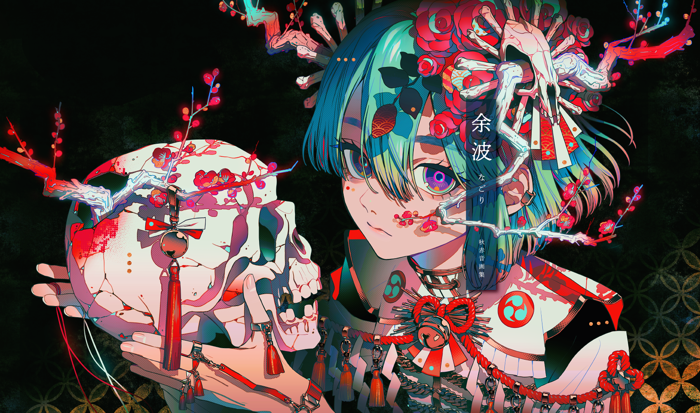

###  Nice to meet you! My name is Maykol Chang!

#### - About Me 💬 :

:man_student: Right now I'm a student at Universidad Latina de Panama in Lic. Ing. Sistemas Informaticos.
  :star: I like to learn new stuffs and contents.
  :computer: I am a begginer in the programming field.

#### - Hobbies :zap: : 
:video_game: Gaming
  :white_flower: Watching Anime
  :book: Reading Manga
  :runner: Soccer, Table Tennis, Runner

 <b>I'm currently learning... <b>

  
  
  
  
 
  

  
  ###  Follow me on
  
  <a
  
